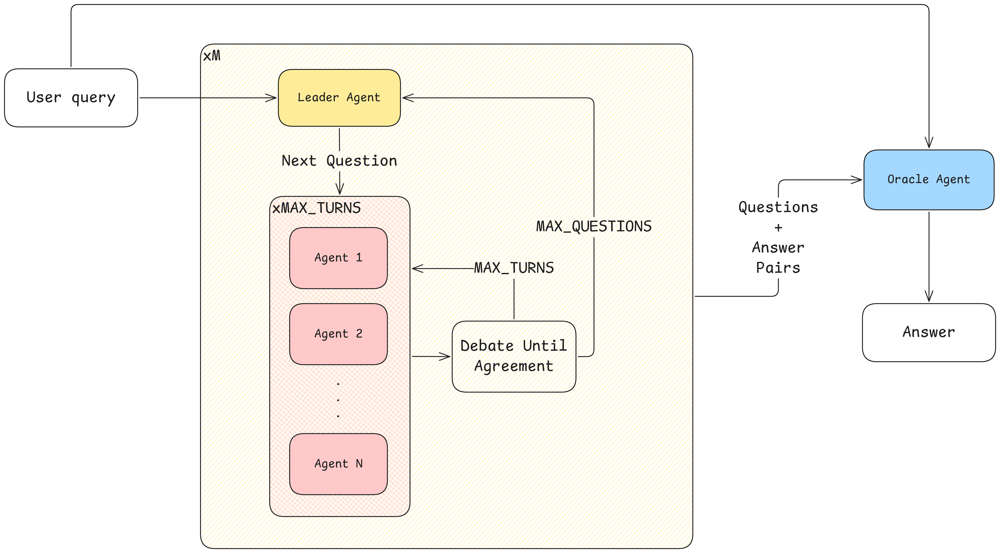

# Chain of Debate

A collaborative AI debate system that leverages multiple AI agents to solve complex problems through structured argumentation and consensus-building.



## Overview

Chain of Debate is a Python library that implements a multi-agent debate system where:

- A **Leader Agent** asks probing questions to explore the problem space
- Multiple **Debate Agents** with different perspectives argue and collaborate to answer each question
- An **Oracle Agent** synthesizes the final answer from the collective discussion

This approach mimics human collaborative problem-solving and often produces more robust, well-reasoned solutions than single-agent approaches.

## Features

- 🤖 **Multi-Agent Architecture**: Configurable debate agents with distinct personalities and reasoning styles
- 🔄 **Async Processing**: Optimized performance with asynchronous API calls
- 📊 **Progress Tracking**: Real-time progress bars and detailed execution metrics
- 🎛️ **Flexible Configuration**: JSON-based agent configs and YAML-based prompts
- 📝 **Comprehensive Logging**: Detailed process logs with cost tracking
- 🧩 **Special Agent Support**: Code execution and web search capabilities
- 🎨 **Colored Output**: Enhanced readability with ANSI color coding

## Installation

### From Source
```bash
git clone https://github.com/yourusername/chain-of-debate.git
cd chain-of-debate
pip install -e .
```

## Quick Start

### Basic Usage

```python
import os
from chain_of_debate import ChainOfDebate

# Set your OpenAI API key
os.environ["OPENAI_API_KEY"] = "your-api-key-here"

# Initialize the system
cod = ChainOfDebate(
    n_debate_agents=3,
    max_rounds_per_debate=5,
    max_questions=5,
    verbose=True
)

# Run a debate
question = "What are the ethical implications of artificial general intelligence?"
result = cod.run(question)
print(result)
```

### Command Line Interface

```bash
# Run with a question from a file
echo "Your question here" > question.txt
chain-of-debate --question-file question.txt

# Run with direct question input
chain-of-debate --question "What is the best approach to climate change?"

# Use different agent configurations
chain-of-debate --question "Your question" --agent-config creative

# Enable special agents
chain-of-debate --question "Analyze this data" --code-execution --web-search
```

### Advanced Configuration

```python
from chain_of_debate import ChainOfDebate

# Custom agent configurations
custom_agents = [
    {
        "name": "Domain Expert",
        "description": "Specialist with deep technical knowledge",
        "temperature": 0.3
    },
    {
        "name": "Creative Thinker", 
        "description": "Innovative problem solver with unconventional approaches",
        "temperature": 1.2
    }
]

# Advanced setup
cod = ChainOfDebate(
    n_debate_agents=2,
    max_rounds_per_debate=3,
    max_questions=8,
    leader_model="gpt-4",
    oracle_model="gpt-4",
    debate_model="gpt-3.5-turbo",
    debate_agent_configs=custom_agents,
    include_code_execution=True,
    include_web_search=True,
    save_log=True,
    verbose=True
)

result = cod.run("How can we optimize renewable energy storage?")
```

## Configuration

### Agent Configurations

The system supports three built-in agent configuration types:

- **default**: Balanced mix of creative, critical, and synthesizing agents
- **conservative**: Evidence-focused, methodical agents  
- **creative**: High-creativity agents for innovative problem solving

You can also provide custom agent configurations as shown above.

### Model Configuration

Support for different OpenAI models:

```python
cod = ChainOfDebate(
    leader_model="gpt-4",      # Leader asks questions
    oracle_model="gpt-4",      # Oracle synthesizes final answer  
    debate_model="gpt-3.5-turbo",  # Default for debate agents
    debate_agent_models={      # Override per specific agent
        "Creative Explorer": "gpt-4",
        "Critical Analyst": "gpt-3.5-turbo"
    }
)
```

### Special Agents

Enable additional capabilities:

```python
cod = ChainOfDebate(
    include_code_execution=True,  # Adds Python code execution agent
    include_web_search=True,      # Adds web research agent
    # ... other parameters
)
```

## API Reference

### ChainOfDebate Class

#### Constructor Parameters

- `n_debate_agents` (int): Number of debate agents (default: 3)
- `max_rounds_per_debate` (int): Maximum debate rounds per question (default: 5)  
- `max_questions` (int): Maximum questions the leader can ask (default: 10)
- `leader_model` (str): Model for leader agent (default: "gpt-4.1")
- `oracle_model` (str): Model for oracle agent (default: "gpt-4.1")
- `debate_model` (str): Default model for debate agents (default: "gpt-4.1")
- `debate_agent_models` (dict): Override models per agent name
- `leader_temperature` (float): Temperature for leader (default: 0.5)
- `oracle_temperature` (float): Temperature for oracle (default: 0.2)
- `max_tokens_per_response` (int): Token limit per response (default: 512)
- `max_tokens_final_response` (int): Token limit for final answer (default: 1024)
- `top_p` (float): Top-p sampling parameter (default: 0.95)
- `verbose` (bool): Enable detailed logging (default: False)
- `progressbar` (bool): Show progress bars (default: True)
- `save_log` (bool): Save detailed logs to file (default: True)
- `use_async` (bool): Use async API calls (default: True)
- `debate_agent_configs` (list): Custom agent configurations
- `agent_config_type` (str): Built-in config type ("default", "conservative", "creative")
- `include_code_execution` (bool): Add code execution agent (default: False)
- `include_web_search` (bool): Add web search agent (default: False)

#### Methods

- `run(question: str) -> str`: Execute the complete debate process
- `get_debug_summary() -> dict`: Get execution statistics and costs
- `print_debug_summary()`: Print formatted debug information
- `get_log_file_path() -> str`: Get path to the saved log file

## Examples

### Example 1: Scientific Problem Solving

```python
question = """
A new drug shows promising results in early trials but has potential 
side effects. How should we approach the risk-benefit analysis for 
FDA approval?
"""

cod = ChainOfDebate(
    agent_config_type="conservative",  # Use evidence-focused agents
    max_questions=10,
    verbose=True
)

result = cod.run(question)
```

### Example 2: Creative Problem Solving

```python
question = """
Design a sustainable transportation system for a city of 2 million people 
that reduces emissions by 80% within 10 years.
"""

cod = ChainOfDebate(
    agent_config_type="creative",  # Use high-creativity agents
    include_code_execution=True,   # Enable data analysis
    include_web_search=True,       # Enable research
    max_rounds_per_debate=7,
    verbose=True
)

result = cod.run(question)
```

### Example 3: Technical Analysis

```python
question = """
Analyze the trade-offs between microservices and monolithic architecture 
for a fintech startup's backend system.
"""

# Custom technical agents
tech_agents = [
    {
        "name": "Systems Architect",
        "description": "Expert in large-scale system design and architecture patterns",
        "temperature": 0.4
    },
    {
        "name": "DevOps Engineer", 
        "description": "Specialist in deployment, scaling, and operational concerns",
        "temperature": 0.6
    },
    {
        "name": "Security Expert",
        "description": "Focus on security implications and compliance requirements",
        "temperature": 0.3
    }
]

cod = ChainOfDebate(
    debate_agent_configs=tech_agents,
    leader_model="gpt-4",
    oracle_model="gpt-4",
    verbose=True
)

result = cod.run(question)
```

## Cost Tracking

The system provides detailed cost tracking:

```python
result = cod.run(question)

# Get cost summary
summary = cod.get_debug_summary()
print(f"Total cost: ${summary['total_cost_usd']:.4f}")
print(f"Total tokens: {summary['total_tokens']['total']:,}")

# Print detailed breakdown
cod.print_debug_summary()
```

## Logging

Comprehensive logging is available:

```python
cod = ChainOfDebate(
    save_log=True,  # Enable log saving
    verbose=True    # Enable console output
)

result = cod.run(question)

# Access the log file path
log_path = cod.last_log_file
print(f"Detailed log saved to: {log_path}")
```

Log files include:
- Complete conversation history
- Timing information
- Token usage and costs
- Agent responses and reasoning
- Debug information

## Configuration Files

The library uses configuration files for prompts and agent definitions:

- `config/prompts.yaml`: System prompts and templates
- `config/agents.json`: Agent personality definitions

These can be customized to modify system behavior.

## Requirements

- Python 3.8+
- OpenAI API key
- Required packages (see requirements.txt):
  - openai>=1.0.0
  - openai-cost-calculator>=0.2.0
  - PyYAML>=6.0
  - tqdm>=4.64.0

## Future Work

Planned improvements and research directions include:

- **Benchmarking**: Systematic comparison of Chain of Debate's performance with existing reasoning-based models (e.g., CoT, Socratic models) and non-reasoning baselines (e.g., direct LLM answers).
- **Evaluation Metrics**: Development of standardized metrics for debate quality, consensus accuracy, and robustness.
- **Expanded Agent Types**: Integration of additional agent roles and domain-specific expertise.
- **Human-in-the-Loop**: Incorporation of human feedback and interactive debate moderation.
- **Scalability**: Optimization for larger debates and distributed execution.
- **Open Benchmarks**: Release of public benchmark datasets and evaluation scripts for reproducibility.

Contributions and suggestions for further enhancements are welcome.

## Contributing

1. Fork the repository
2. Create a feature branch
3. Make your changes
4. Add tests if applicable
5. Submit a pull request

## License

This project is licensed under the MIT License - see the LICENSE file for details.

## Support

- GitHub Issues: [Report bugs or request features](https://github.com/yourusername/chain-of-debate/issues)
- Documentation: [Wiki](https://github.com/yourusername/chain-of-debate/wiki)
- Email: your.email@example.com

## Citation

If you use Chain of Debate in your research, please cite:

```bibtex
@software{chain_of_debate,
  title={Chain of Debate: A Collaborative AI Debate System},
  author={Your Name},
  year={2025},
  url={https://github.com/yourusername/chain-of-debate}
}
```
